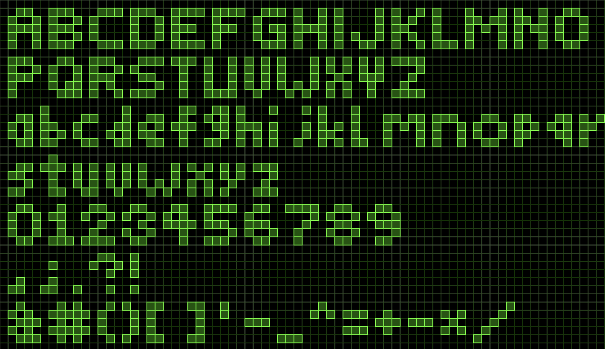
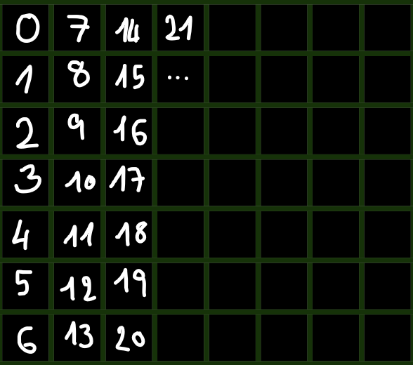

# commit_font 


This project's purpose is to give a simple way to stylize your GitHub profile page by creating commits in a project so that in your GitHub contribution graph it appears as letters, as symbols, as numbers, as a message you write such as:


The font used in this repository and that will appear on your GitHub contribution graph is based on a generated pixel art font from [Gamergeeks' Pixel Letters Generator](https://www.gamergeeks.net/apps/pixel/letter-text-generator). 




## Usage ༼ つ ◕_◕ ༽つ

Here is the kernel structure of each element's font to be commited:

```bash
START_DATE="2023-02-26" #The beginning date of the commit for the first letter

#-----------------------------------------------------------------------
for i in 2 5 8 10 12 15 17 19 22 25 #The corresponding pixel indexes to be coloured/commited in a for-loop
do
    DATE=$(date -d "$START_DATE +$i days 12:00:00" +"%Y-%m-%dT%H:%M:%S") #Computes the new date according to the pixel index

    echo "$DATE" >> modifier.txt #Modify a file to allow to create a new commit with a content
    git add modifier.txt #Add the file modification to the commit

    #Set the date to the corresponding in the loop
    GIT_AUTHOR_DATE="$DATE" \
    GIT_COMMITTER_DATE="$DATE" \
    git commit -m "Letter S - commit pixel: $i" #Make the commit
done
#-----------------------------------------------------------------------
```
To write a message, take these blocks from their corresponding files and copy paste them one after another. To launch the process, you can either run a shell file with all the letters copypasted one after or copypaste it directly in ***git bash*** but you MUST be in the ***root*** directory of your project.

> [!WARNING]
> **Warning:** This operation will modify your git history. 
> **Warning:** Don't forget to initialize the correct starting date for each element to avoid overlapping between them.


## How does it work? o(*￣▽￣*)o

The principle is simple and explained in the ***commit_font.sh*** first loop, first letter. You get to analyze the process line by line and understand it but to modify it yourself and make it your own, the important point is the indexes used. The indexes used in the for-loop correspond each to a pixel that will be colored by the commit, they are based on a structure that has columns of 7 lines and that increase going down in the columns as illustrated below.




## Project Structure ^_____^

    resources
    └── images
        └── ...                             # Images used in the project

    src
    ├── lowercase_letters
    │   └── ...                             # Lowercase letter pixel patterns
    │
    ├── numbers
    │   └── ...                             # Number pixel patterns
    │
    ├── symbols
    │   └── ...                             # Symbol pixel patterns
    │
    ├── uppercase_letters
    │   └── ...                             # Uppercase letter pixel patterns
    │
    └── commit_font.sh                      # Script generating example the Git commit history

    .gitignore                              # Git configuration exlusions
    modifier.txt                            # File modified to create the commits
    README.md                               # README file
    LICENSE.md                              # LICENSE file


## Authors (⌐■_■)

<a href="https://github.com/SalimMc/commit_font/graphs/contributors">
  
</a>


## 📄 License

For more details, see the LICENSE file.